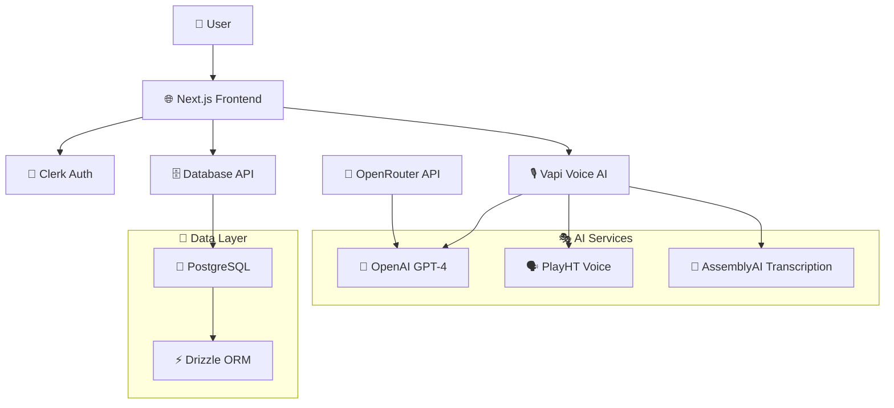

# 🩺 Medical Consultation AI


[]()
[]()

> **Revolutionize Patient Care with AI Voice Agents** - Deliver instant, accurate medical assistance through natural voice conversations. Automate appointment scheduling, symptom triage, and follow-up care—24/7.


## 🌟 Features

### 🎯 Core Functionality
- **🗣️ AI Voice Consultations** - Real-time voice conversations with specialized AI doctors
- **👨‍⚕️ Multiple Specialists** - 10+ AI doctor specialists (General Physician, Pediatrician, Dermatologist, etc.)
- **📝 Live Transcription** - Real-time speech-to-text with conversation history
- **🔊 Natural Voice Synthesis** - High-quality AI voices for each specialist
- **📊 Session Management** - Complete consultation history and session tracking

### 🏥 Medical Specialists Available
| Specialist | Description | Voice | Premium |
|------------|-------------|-------|---------|
| 🩺 General Physician | Everyday health concerns and common symptoms | Will | ❌ Free |
| 👶 Pediatrician | Children's health, from babies to teens | Chris | ✅ Premium |
| 🌡️ Dermatologist | Skin issues like rashes, acne, or infections | Sarge | ✅ Premium |
| 🧠 Psychologist | Mental health and emotional well-being | Susan | ✅ Premium |
| 🥗 Nutritionist | Healthy eating and weight management | Eileen | ✅ Premium |
| ❤️ Cardiologist | Heart health and blood pressure issues | Charlotte | ✅ Premium |
| 👂 ENT Specialist | Ear, nose, and throat problems | Ayla | ✅ Premium |
| 🦴 Orthopedic | Bone, joint, and muscle pain | Aaliyah | ✅ Premium |
| 🔬 Gynecologist | Women's reproductive and hormonal health | Hudson | ✅ Premium |
| 🦷 Dentist | Oral hygiene and dental problems | Atlas | ✅ Premium |

### 🎨 User Experience
- **🌓 Dark/Light Mode** - Seamless theme switching
- **📱 Responsive Design** - Works perfectly on all devices
- **🔐 Secure Authentication** - Powered by Clerk
- **💳 Subscription Management** - Integrated billing and premium features
- **📈 Analytics Dashboard** - Track your health consultation history

## 🏗️ Architecture



## 🚀 Tech Stack

### Frontend
- **[Next.js 15](https://nextjs.org/)** - React framework with App Router
- **[React 19](https://react.dev/)** - UI library with latest features
- **[TypeScript](https://www.typescriptlang.org/)** - Type-safe development
- **[Tailwind CSS](https://tailwindcss.com/)** - Utility-first CSS framework
- **[Radix UI](https://www.radix-ui.com/)** - Accessible component primitives
- **[Framer Motion](https://www.framer.com/motion/)** - Smooth animations

### Backend & Database
- **[PostgreSQL](https://www.postgresql.org/)** - Robust relational database
- **[Drizzle ORM](https://orm.drizzle.team/)** - Type-safe database toolkit
- **[Neon](https://neon.tech/)** - Serverless PostgreSQL platform

### AI & Voice Services
- **[OpenAI GPT-4](https://openai.com/)** - Advanced language model
- **[OpenRouter](https://openrouter.ai/)** - AI model routing service
- **[Vapi](https://vapi.ai/)** - Voice AI platform
- **[PlayHT](https://play.ht/)** - Natural voice synthesis
- **[AssemblyAI](https://www.assemblyai.com/)** - Speech-to-text transcription

### Authentication & Payments
- **[Clerk](https://clerk.com/)** - Complete authentication solution
- **[Clerk Pricing](https://clerk.com/pricing)** - Subscription management

### Development Tools
- **[ESLint](https://eslint.org/)** - Code linting
- **[Prettier](https://prettier.io/)** - Code formatting
- **[Husky](https://typicode.github.io/husky/)** - Git hooks

## 🛠️ Installation & Setup

### Prerequisites

- **Node.js** 18.17+ or 20.5+
- **npm**, **yarn**, **pnpm**, or **bun**
- **PostgreSQL** database (or Neon account)
- **Git**

### Required API Keys

Before running the application, you'll need to obtain the following API keys:

1. **[Clerk](https://clerk.com/)** - Authentication
2. **[Neon](https://neon.tech/)** - PostgreSQL database
3. **[OpenRouter](https://openrouter.ai/)** - AI model access
4. **[Vapi](https://vapi.ai/)** - Voice AI platform

### 📥 Quick Start

1. **Install dependencies**

```bash
# Using npm
npm install

# Using yarn
yarn install

# Using pnpm
pnpm install

# Using bun
bun install
```

2. **Set up environment variables**

Create a `.env.local` file in the root directory:

```env
# Database
DATABASE_URL="postgresql://your-neon-connection-string"

# Clerk Authentication
NEXT_PUBLIC_CLERK_PUBLISHABLE_KEY=pk_test_your-key
CLERK_SECRET_KEY=sk_test_your-key
NEXT_PUBLIC_CLERK_SIGN_IN_URL=/sign-in
NEXT_PUBLIC_CLERK_SIGN_UP_URL=/sign-up
NEXT_PUBLIC_CLERK_AFTER_SIGN_IN_URL=/dashboard
NEXT_PUBLIC_CLERK_AFTER_SIGN_UP_URL=/dashboard

# AI Services
OPEN_ROUTER_API_KEY=your-openrouter-api-key
NEXT_PUBLIC_VAPI_API_KEY=your-vapi-api-key

# Optional: OpenAI Direct (if not using OpenRouter)
OPENAI_API_KEY=your-openai-api-key
```

3. **Set up the database**

```bash
# Generate database schema
npm run db:generate

# Push schema to database
npm run db:push

# Optional: Open Drizzle Studio
npm run db:studio
```

4. **Run the development server**

```bash
npm run dev
```

5. **Open your browser**

Navigate to [http://localhost:3000](http://localhost:3000)

## 📁 Project Structure

```
medical-consultation-ai/
├── 📁 app/                          # Next.js App Router
│   ├── 📁 (auth)/                   # Authentication routes
│   │   ├── 📁 sign-in/
│   │   └── 📁 sign-up/
│   ├── 📁 (routes)/                 # Protected routes
│   │   └── 📁 dashboard/            # Main application
│   │       ├── 📁 _components/      # Dashboard components
│   │       ├── 📁 medical-agent/    # Voice consultation
│   │       ├── 📁 billing/          # Subscription management
│   │       ├── 📁 history/          # Consultation history
│   │       └── 📁 profile/          # User profile
│   ├── 📁 api/                      # API routes
│   │   ├── 📁 session-chat/         # Session management
│   │   ├── 📁 suggest-doctors/      # AI doctor recommendations
│   │   └── 📁 users/                # User management
│   └── 📁 _components/              # Shared components
├── 📁 components/                   # UI components
│   └── 📁 ui/                       # Reusable UI components
├── 📁 config/                       # Configuration files
│   ├── 📄 db.tsx                    # Database configuration
│   ├── 📄 OpenAiModel.tsx           # AI model configuration
│   └── 📄 schema.tsx                # Database schema
├── 📁 context/                      # React contexts
├── 📁 lib/                          # Utility functions
├── 📁 list/                         # Data lists (AI doctors)
├── 📁 public/                       # Static assets
└── 📄 package.json                  # Dependencies
```

## 🔧 Configuration

### Database Schema

The application uses a simple but effective database schema with two main tables:
- **Users table** - Stores user information including name, email, and credits
- **Session chat table** - Stores consultation sessions with doctor selection, notes, conversations, and reports

### AI Doctor Configuration

New AI specialists can be added by modifying the `list/list.tsx` file. Each specialist includes:
- Unique ID and specialist type
- Description and image
- AI prompt for personality
- Voice ID for text-to-speech
- Premium subscription requirement


## 🙏 Acknowledgments

- **[Vapi](https://vapi.ai/)** for excellent voice AI platform
- **[Clerk](https://clerk.com/)** for seamless authentication
- **[OpenRouter](https://openrouter.ai/)** for AI model access
- **[Neon](https://neon.tech/)** for serverless PostgreSQL
- **[Radix UI](https://www.radix-ui.com/)** for accessible components
- **[Tailwind CSS](https://tailwindcss.com/)** for amazing styling utilities


---

<div align="center">

**Made with ❤️ for better healthcare accessibility**

*Personal project for revolutionizing medical consultations with AI*

</div>
